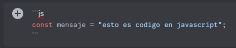

# Before Asking

### Tabla de contenidos

- [No preguntes para preguntar](#no-preguntes-para-preguntar)
- [Escribir código con formato](#escribir-codigo-con-formato)
- [Cómo formular eficazmente una pregunta](#como-formular-eficazmente-una-pregunta)

## [No preguntes para preguntar](#no-preguntes-para-preguntar)

Evita preguntar si "puedes preguntar" o si alguien te puede ayudar.
En algunos casos se puede ver a gente hacer preguntas del siguiente estilo:

```
Usuario: Alguien sabe Python?
```

Y hay varias razones por las que esta es una pregunta problematica, por ejemplo:
- Excluye a las personas que puedan leer la pregunta pero no saber la tecnologia especifica
- Hace que otros usuarios duden de sus habilidades para responderte
- Es una pregunta floja ya que no menciona el problema

Hacer preguntas de este estilo disminuye tus probabilidades de obtener una respuesta por que le pides a otras personas que cumplan con ciertos requisitos para responderte, ademas, si el problema no esta escrito junto a tu pregunta puede sentirse como que no estas dispuesto a describir tu problema al menos que alguien pueda ayudarte, lo cual se ve flojo, mejor directamente haz la pregunta para que te podamos ayudar lo antes posible, esto nos ahorra tiempo tanto a ti como a nosotros.

## [Escribir código con formato](#escribir-codigo-con-formato)

En vez de pegar tu código con texto plano, mejor dale formato. Para hacer esto, Discord nos permite usar [markdown](https://markdown.es/) en los mensajes. Para dar formato al código, simplemente escribe el código entre estas comillas como se ve en la siguiente imagen.


También puedes especificar el lenguaje al lado de las comillas para el resaltado de sintaxis.



Aquí puedes ver la diferencia entre ambos:


Si no puedes encontrar las comillas en el teclado, puedes copiar este esqueleto:

````md
```js
// Escribe el codigo aqui
```
````

## [Cómo formular eficazmente una pregunta](#como-formular-eficazmente-una-pregunta)

Cuando vayas a hacer una pregunta, intenta explicar todo en un mensaje de forma detallada y a poder ser con ejemplos. Va a ser mucho más rapido que nos digas la duda en un solo mensaje a que empecemos a preguntarte por cosas que ya podrías haber escrito antes. Es muy importante incluir el código si es que la duda lo requiere.
Puedes seguir esta estructura:

- Descripción de la duda
- Trozo de código problemático (con [formato de código](#escribir-codigo-con-formato))
- Captura de un ejemplo (por ejemplo si es de CSS, puedes hacer una captura en la web de como se ve el problema)
