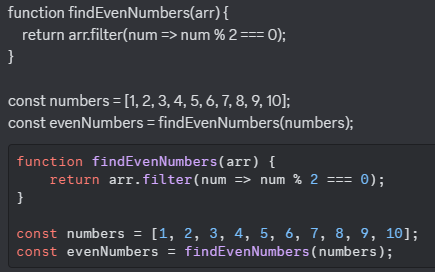

# Before Asking

### Tabla de contenidos
- [No preguntes para preguntar](#no-preguntes-para-preguntar)
- [Escribir codigo con formato](#escribir-codigo-con-formato)

## [No preguntes para preguntar](#no-preguntes-para-preguntar)

Evita preguntar si "puedes preguntar" o si alguien te puede ayudar, directamente haz la pregunta para que te podamos ayudar lo antes posible, esto nos ahorra tiempo tanto a ti como a nosotros.

## [Escribir codigo con formato](#escribir-codigo-con-formato)

En vez de pegar tu código con texto plano, mejor dale formato. Para hacer esto, Discord nos permite usar [markdown](https://markdown.es/) en los mensajes. Para dar formato al código, simplemente escribe el código entre estas comillas como se ve en la siguiente imagen.


También puedes especificar el lenguaje al lado de las comillas para el resaltado de sintaxis.


Aquí puedes ver la diferencia entre ambos:



Si no puedes encontrar las comillas en el teclado, puedes copiar este esqueleto:

````md
```js
// Escribe el codigo aqui
```
````